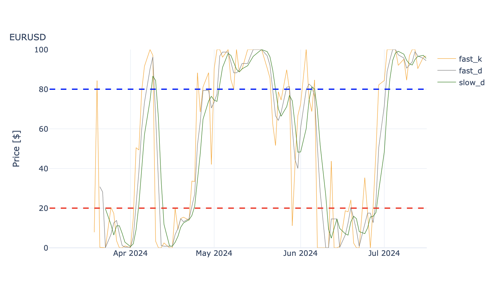

# HsTrader-Stochastic-Oscillator



## HsTrader Library

`HsTrader` is a Python library designed to interact with financial markets. It provides various functionalities such as fetching market data, placing orders, and managing trading accounts. This library supports multiple financial instruments including forex, stocks, and cryptocurrencies.

### Key Features

- **Market Data Retrieval:** Fetch historical and real-time market data for various financial instruments.
- **Order Management:** Place, modify, and cancel trades programmatically.
- **Account Management:** Retrieve account information, balance, and transaction history.
- **Event Handling:** Subscribe to market events and execute custom strategies based on real-time data.

### Installation

To install the `hstrader` library, use the following pip command:

```sh
pip install hstrader
```

## Stochastic Oscillator

The Stochastic Oscillator is a momentum indicator that shows the location of the closing price relative to the high-low range over a set number of periods. It is primarily used to identify overbought and oversold conditions.

### Calculation

The Stochastic Oscillator consists of two lines:

- **%K Line:** The main line that measures the current close relative to the high-low range.
- **%D Line:** A moving average of the %K line, which smooths out the fluctuations and provides a clearer signal.

The formulas for these lines are:

- **%K = [(Current Close - Lowest Low) / (Highest High - Lowest Low)] * 100**

  - **Current Close:** The most recent closing price.
  - **Lowest Low:** The lowest price over the last `n` periods.
  - **Highest High:** The highest price over the last `n` periods.

- **%D = 3-period moving average of %K**

### Interpretation

- **Overbought and Oversold Levels:** Typically, readings above 80 indicate overbought conditions, while readings below 20 indicate oversold conditions.
- **Crossovers:** Bullish signals are generated when the %K line crosses above the %D line, suggesting a potential upward movement. Conversely, bearish signals occur when the %K line crosses below the %D line, suggesting a potential downward movement.

### Steps in the Algorithm

1. **Data Preparation:**
   - Fetch historical market data for the ticker.
   - Convert the data into a pandas DataFrame and adjust the time column to retain only the date.

2. **Stochastic Oscillator Calculation:**
   - Iterate over the data to calculate the %K and %D lines.
   - Identify the highest high and lowest low for the specified period (default is 14 days).
   - Compute the %K values using the formula.
   - Compute the %D values as a 3-day moving average of the %K values.

3. **Visualization:**
   - Plot the %K and %D lines using Plotly to visualize the oscillator.
   - Overlay the market price and moving averages for a comprehensive analysis.

## Applying the Algorithm

The algorithm can be applied to various financial instruments and timeframes by adjusting the period and data source. It is a versatile tool for traders to identify potential entry and exit points based on momentum and trend reversals.

<!-- ### Example Visualization

Here is an example of how the Stochastic Oscillator can be visualized:

- **%K Line:** Orange line representing the current momentum.
- **%D Line:** Grey line representing the smoothed momentum.
- **Overbought and Oversold Levels:** Blue and red dashed lines at 80 and 20, respectively.

This visualization helps traders quickly identify overbought and oversold conditions and make informed trading decisions. -->

## Conclusion

The Stochastic Oscillator is a powerful tool for momentum analysis. By understanding and applying this algorithm, traders can enhance their ability to predict market movements and optimize their trading strategies.
